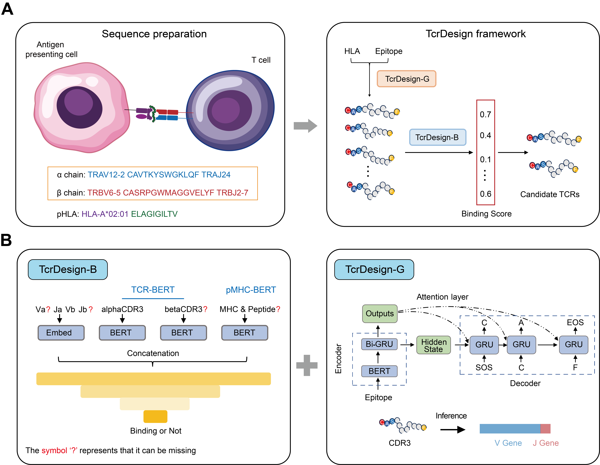

<p align="center">
  
</p>

---

This repository provides an implementation of the inference pipeline of TcrDesign.

We also provide the weights and datasets used for TcrDesign. For details, please refer to [https://zenodo.org/records/14545852](https://zenodo.org/records/14545852).

## Main models

TcrDesign comprises two components: **TcrDesign-B** (the binding model) and **TcrDesign-G** (the generation model).

**TcrDesign-B** accurately predicts interactions between epitopes and TCRs, incorporating full information such as VJ gene usage and MHC, and achieves state-of-the-art performance.

**TcrDesign-G** effectively generates a large number of epitope-specific TCRs.

## Installation
First, please download the repository `git clone https://github.com/XSLiuLab/TcrDesign`

```
1. conda create -n tcrdesign python=3.8.16 && conda activate tcrdesign
2. conda install numpy=1.23.5 pandas=1.5.3 scikit-learn=1.2.2 tqdm=4.65.0 editdistance Levenshtein
3. conda install pytorch==1.12.0 torchvision==0.13.0 torchaudio==0.12.0 cudatoolkit=11.3 -c pytorch
4. pip install matplotlib seaborn tensorboard transformers
```

Please download `tcrdesign_weights.tar.gz`​ from [https://zenodo.org/records/14545852](https://zenodo.org/records/14545852), extract and place the contents in the `'weights' folder`​.

## Usage

### TcrDesign-B

#### Example 1: binding prediction for single sample

For missing values, please use `'X'`​ as a placeholder.

```
python TcrDesign/tcrdesign_B.py -mode single -alphav TRAV12-2 -alphaj X -alpha_cdr3 CAVRGTGRRALTF -betav TRBV6-6 -betaj X -beta_cdr3 CASSFATEAFF -epitope GLYDGMEHL -mhc HLA-A02:01 -cuda False
```

#### Example 2: binding prediction for batch samples

Prepare a tab-delimited file following the format of `TcrDesign/example/Binding_batch_example.tsv`​. Convert MHC data using `TcrDesign/data/mhc_pseudo/mhc_all.dat`​ as reference. Replace missing values with `X`​.

```
python TcrDesign/tcrdesign_B.py -mode batch -data_path TcrDesign/example/Binding_batch_example.tsv -cuda True
```

### TcrDesign-G

#### Example 1: generation bCDR3s for a specific epitope

```
python TcrDesign/tcrdesign_G.py -mode beta -epitope GILGFVFTL -num 100 -maxLen 20 -cuda True
```

#### Example 2: generation aCDR3s for a specific epitope

```
python TcrDesign/tcrdesign_G.py -mode alpha -epitope GILGFVFTL -bcdr3 CASSIRSTYEQYF -num 100 -maxLen 20 -cuda True
```

#### Example 3: generation VJs for a specific CDR3

```
# aCDR3 for VJ
python TcrDesign/tcrdesign_G.py -mode vj -acdr3 CAVNQGAQKLVF -cuda True
# bCDR3 for VJ
python TcrDesign/tcrdesign_G.py -mode vj -bcdr3 CASSIRSTYEQYF -cuda True
```

### TcrDesign

#### Example: generation full-length TCRs for a specific epitope

```
python TcrDesign/tcrdesign.py -epitope GILGFVFTL -mhc HLA-A02:01 -gen_beta_num 30 -gen_alpha_num 100 -cuda True
```

## Citing TcrDesign

If you use TcrDesign in your research, please cite our paper.

---

**Cancer Biology Group @ShanghaiTech**

**Research group led by Xue-Song Liu in ShanghaiTech University**

‍
